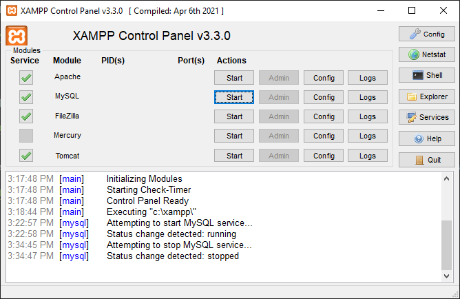
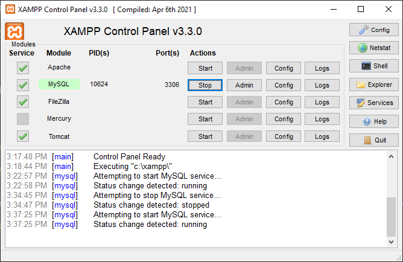
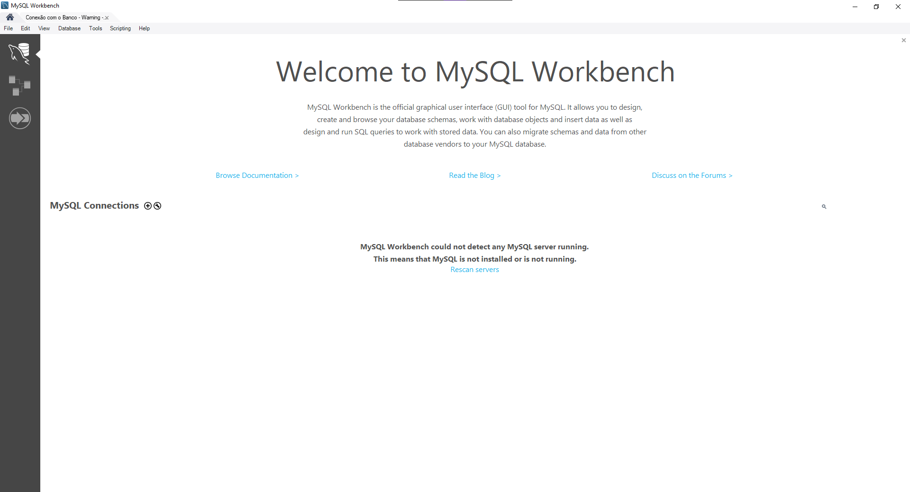

# Requisitos para o projeto

## Requisitos
  - [NodeJs](#NodeJS)
  - [XAMPP](#XAMPP)
  - [Workbench](#Workbench)

## [NodeJS 20.15.0 LTS](https://nodejs.org/pt/download/prebuilt-installer)
NodeJs é o servidor que irá rodar javascript pelo back end, aonde iremos utilizar dele para rodar a api

## [XAMPP 8.2.12 / PHP 8.2.12](https://www.apachefriends.org/pt_br/download.html) (Sempre executar como administrador)

XAMPP é o aplicativo que iremos usar para emular o servidor mysql localmente na nossa máquina

### Tela inicial do XAMPP

    Apertando em start do MYSQL, o servidor irá iniciar e começar a rodar localmente na porta 3306 

## [Workbench 8.0.36](https://dev.mysql.com/downloads/workbench/) 

Workbench é a ferramenta que iremos utilizar para conseguir conectar ao banco de dados, assim conseguiremos vizualizar e manipular as tabelas da nossa api.

#### Imagem da tela inicial do Workbench

